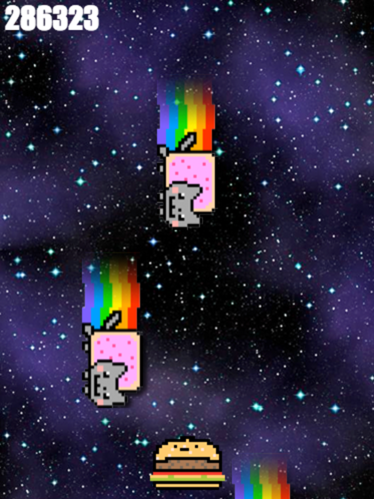

# Object Oriented Programming Game Project

<h2 align="center">I CAN HAZ CHEEZBURGER?!??</h2>

## Introduction
This project is designed as a way for you to practice and learn about Object Oriented Programming in JavaScript. Some code has already been provided; it makes for an almost-working game.

The project is divided in two parts: in a first part, you will fix and implement some basic functionality. In the second part, you will be able to customize the game as you wish!

Most of the interesting stuff happens in the `js/kittens.js` file. This file already contains quite a bit of code with comments.

## The game
This game is called I CAN HAZ CHEEZBURGER?!??. In the game, you play as an anthropomorphic cheeseburger. The only thing you can do is move left or right with the arrows of your keyboard.

The goal of the game is to stay alive as long as possible by avoiding the Nyan Cats who are raining from the sky and trying to haz you. The longer you stay alive, the higher your score!

At the moment, the game is a bit broken. This project will have you first fix the broken game, then add your own features to it :)

## Instructions

1. Clone this repository or download the code, then open the `index.html` file in your browser, and observe what goes on when you load it.
2. After reading the instructions of the project, **take a look at the provided code**. Discuss it with your teammates. Don't worry if you don't understand *everything*, but try to get a general feel for what the code is doing.
3. Notice that the code is using the HTML5 `<canvas>` element to draw the game on the screen. You can familiarize yourself with the Canvas API *as needed* using the [MDN Canvas API Tutorial](https://developer.mozilla.org/en-US/docs/Web/API/Canvas_API/Tutorial).
4. Once the provided code has been consulted, start with the basic section below and go through it at your own team's pace.

## Basic assignments

### 1. Fix the enemy bug
If you look at the game running for a while, you will notice that an enemy never appears at the far left of the screen. This is due to a bug that was intentionally introduced in the `addEnemy` method of the `Engine` class. Find the bug and fix it.

### 2. Make the game *actually* end
If a Nyan Cat gets to you and eats you, the game keeps going on. Let's fix this!

First, look at the `gameLoop` method of the `Engine`. There's a part of the function that calls `this.isPlayerDead()` to verify if the player has died based on the current situation.

Next, look at the `isPlayerDead` method of the `Engine`. Notice that it's always returning `false`, which means that the player is always reported to be alive.

Here, we are going to rewrite the code of this function to actually check if the player should be dead. We will do this by looping over all the enemies, and checking if their box overlaps the player box.

If at least one enemy overlaps the player, then your function should return `true`. Otherwise it should return `false.

As a hint, note that the box of each enemy is defined by its `x` and `y` coordinates and the `ENEMY_WIDTH` and `ENEMY_HEIGHT` constants. There are similar variables for the player.

### 3. Refactor some code
Refactoring code is the action of re-arranging and/or re-writing that code, while keeping the functionality untouched.

Look at the `Player` and `Enemy` classes and notice that their `render` methods are identical. This violates a coding principle called DRY: Don't Repeat Yourself. Let's fix it!

While there are many ways to palliate to this, here we will do it by creating a superclass called `Entity`. This superclass will not need a constructor, and will only have the `render` method.

Then, we'll make `Player` and `Enemy` extend the `Entity` class, and remove the `render` methods from both classes.

Having done this manipulation will break our constructors. Make sure to fix it by calling the `super` function from your constructors.

### 4. Flavor it!

---

Having completed the basic section of this project is already great! However, this should leave you plenty of time for the fun part: customizing and evolving the game. Since this is an open-ended activity, we will give you some suggestions. Feel free to use them or not.

Here is an example of a customized game by Nathaniel Kitzke: https://ziad-saab.github.io/nyan-cat-game/

* Instead of completely stopping the game when it's over, allow the player to start a new game
* Add a sound track and sound effects to the game
* Add the possibility of having lives
* Increase the difficulty level of the game as time passes by making the enemies go faster
* Allow the enemies and player to have animated sprites instead of the current static ones. You could do this by defining a sprite as an array of images and setting a speed at which these images should switch. This could be implemented in the `render` method.
* Allow the player to shoot bullets at the Nyan Cats
* Add another type of entity called `Bonus` that will also fall from the sky and add points to the score
* Make the game more hardcore by allowing the player to also move up/down and making Nyan Cats also shoot from the left of the screen
* **Don't stop!** These suggestions are only here to get you started :)
